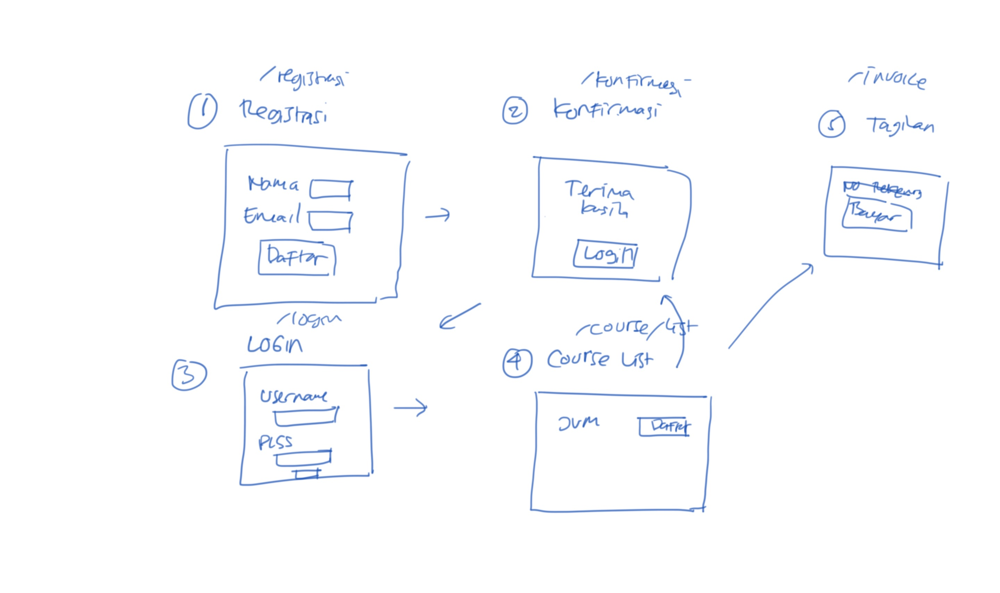
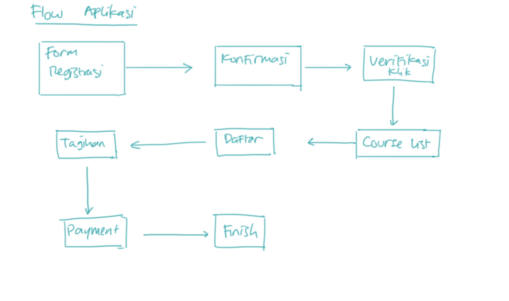
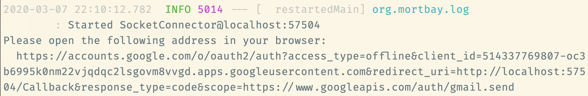

# Aplikasi Registrasi #

Fitur Aplikasi:

* Pendaftaran Peserta Workshop
* Verifikasi email
* Generate tagihan
* Pembayaran

## UI Mockup Aplikasi ##

[]((docs/mockup-aplikasi-registrasi.jpg))

## Flow Aplikasi ##

[]((docs/flow-aplikasi.jpg))


## Cara Membuat Database ##

1. Create user untuk connect ke database

    ```
    createuser -P registrasiuser
    ```

2. Create database untuk user tersebut

    ```
   createdb -Oregistrasiuser registrasidb
   ```

3. Konfigurasi database

    ```
   spring.datasource.url=jdbc:postgresql://localhost/registrasidb
   spring.datasource.username=registrasiuser
   spring.datasource.password=registrasiuser123
   ```

## Setup GMail API ##

1. Jalankan aplikasinya

    ```
    mvn clean spring-boot:run  
    ```

2. Perhatikan console log, nanti ada perintah untuk copas url ke browser seperti ini

    [](docs/setup-gmail-api.png)

3. Buka di browser, berikan otorisasi untuk aplikasi


## Deployment ke Heroku ##

Prasyarat :

* Run di local sudah sukses mengirim email
* Heroku CLI [sudah diinstal](https://devcenter.heroku.com/articles/heroku-cli) dan sudah login

1. Create project di Heroku

2. Jalankan `testConvertClientSecret`, copy outputnya

3. Set environment variable dengan output dari langkah sebelumnya

    ```
    heroku config:set CLIENT_SECRET_JSON=<output langkah sebelumnya>
    ```

4. Jalankan `testConvertStoredCredential`, copy outputnya

5. Set environment variable dengan output dari langkah sebelumnya

    ```
    heroku config:set STORED_CREDENTIAL=<output langkah sebelumnya>
    ```

6. Set environment variable untuk Spring Profile

    ```
    heroku config:set SPRING_PROFILES_ACTIVE=heroku
    ```
   
7. Set environment variable untuk `server.url`

    ```
    heroku config:set SERVER_URL=<https://nama-aplikasi.herokuapp.com>
    ```

8. Create database PostgreSQL

    ```
    heroku addons:create heroku-postgresql:hobby-dev
    ```

9. Deploy aplikasi

    ```
    git push heroku master && heroku logs --tail
    ```

## Referensi ##

* [Cara mengirim email dengan GMail API](https://software.endy.muhardin.com/java/mengirim-email-gmail-api/)
* [Konsep Spring Framework](https://www.youtube.com/playlist?list=PL9oC_cq7OYbyhdZmCECQqp7OcS8J5QpAo)